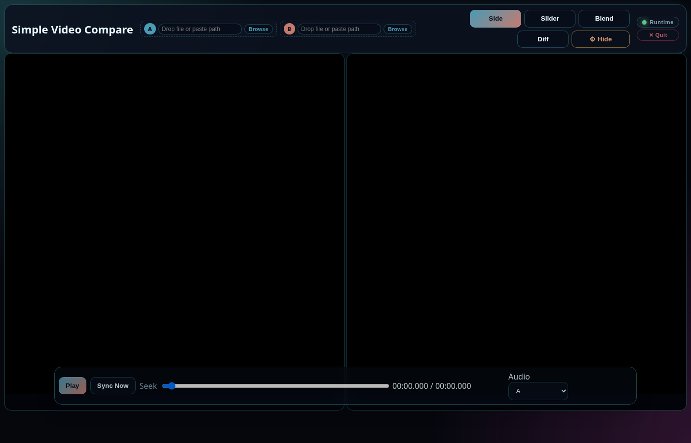

# DaSiWa Simple Video Compare



Ein natives Desktop-Tool zum seitlichen Vergleich zweier lokaler Videodateien. Die Wiedergabe läuft über libmpv/FFmpeg statt über ein Browser-`<video>`-Element und ist daher nicht auf Browser-Codecs beschränkt.

## Features

- Standalone-UX: Eigenes Desktop-Fenster, kein Browser und kein lokaler Webserver im Standardmodus
- libmpv-Wiedergabe: Decoder, Demuxer, Untertitel und Hardwarebeschleunigung aus der lokalen mpv/FFmpeg-Installation
- Synchroner Vergleich: Zwei unabhängige native Player, gemeinsame Wiedergabe, Seek und expliziter Sync
- Lokale Datei-Auswahl: Native Dateidialoge oder Datei-Drop direkt auf die linke/rechte Videohälfte; zwei gleichzeitig gedroppte Dateien belegen A und B
- Gebündeltes libmpv: Der Linux-Build legt `libmpv.so` neben das Binary und verwendet einen relativen Runtime-Pfad
- Legacy-Browsermodus: Die bisherige Weboberfläche bleibt mit `--browser` verfügbar

## Voraussetzungen

- Go 1.25 oder neuer (zum Bauen)
- libmpv inklusive Entwicklungsdateien auf dem Build-System
- Linux-Beispiel: Paket `mpv` sowie das zugehörige Entwicklungs-Paket der Distribution

Die gebauten Linux-Bundles enthalten `libmpv.so`; die übrigen dynamischen Basisbibliotheken des Zielsystems (z. B. libc, X11, Audio-/GPU-Treiber) bleiben absichtlich Systemabhängigkeiten.

## Schnellstart

```bash
go run ./cmd/dasiwa-simple-video-compare
```

Die bisherige Browseroberfläche starten:

```bash
go run ./cmd/dasiwa-simple-video-compare --browser
```

## Build

```bash
go build -o ./dasiwa-simple-video-compare-linux-amd64 ./cmd/dasiwa-simple-video-compare
go build -o ./dist/dasiwa-simple-video-compare-linux-amd64 ./cmd/dasiwa-simple-video-compare
```

Die Linux-Binaries benötigen zur Laufzeit die Systembibliothek `libmpv.so`.

## Projektstruktur

```
├── cmd/dasiwa-simple-video-compare/
│   ├── main.go              # Einstiegspunkt für die Desktop-UX
│   └── web/                 # Eingebettete Assets für den optionalen Browsermodus
├── internal/
│   ├── player/              # libmpv-basierte native Video-Renderer
│   ├── media/               # FFmpeg/FFprobe-Werkzeugerkennung
│   └── server/              # HTTP-Server für den optionalen Browsermodus
├── assets/                  # Projekt-Assets (Screenshots, Icons)
├── dist/                    # Kompilierte Binaries
└── go.mod                   # Go-Moduldefinition
```

Der Browsermodus stellt weiterhin die bisherigen lokalen HTTP-Endpunkte bereit.

## Lizenz

Eigenentwicklung im Rahmen von DaSiWa Tooling.
